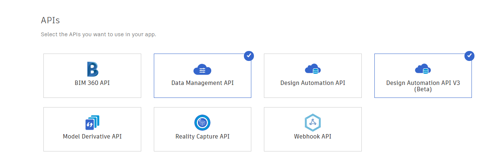

# au2019-forge-revit-to-fbx

Demonstrates using the Forge Design Automation API for 3ds Max to convert Revit files to FBX. 

This project was cloned from the [Forge Design Automation API for 3ds Max](https://github.com/Autodesk-Forge/design.automation.3dsmax-nodejs-basic).

# Setup

## Prerequisites

* Node.js 10 or later

## Running locally

1. Register for a Forge application at https://forge.autodesk.com/myapps/create#. You'll need the key and secret for building and running any sample apps
    * Choose *Design Automation API V3* and *Data Management API* for the APIs you want to use in your app.
    
    
### Setup Config file

Inside the /config folder you will see a file named ```default.json```.

2. Inside this file you will need to provide the following information:

```javascript
{
	"forge": {
		"clientId": "Setup your forge client id here",
		"clientSecret": "Setup your forge client secret here",
		"ossBucketName": "Choose a unique OSS bucket name where the inputs and output will be uploaded must be of the form [-_.a-z0-9]{3,128} "
	}
}
```
 
3. Open a command prompt in the repo's root folder and follow these steps: 

- Install the npm packages by running: 
	
	```
	npm install
	```
 
- Create your appBundle by running:
	
	```
	node createAndUploadApp.js
	```

- Create your activity by running:
	
	```
	node createActivity.js
	```

- Launch a workitem to convert your 3dsMax file to FBX:
	
	```
	node executeWorkitem.js C:/path/to/yourfile.rvt
	```

## Developer Notes

The code for performing the work done in 3ds Max to import Revit, convert materials, and export the FBX file is performed 
by a MAXScript script embedded in the handlebar template at: 
https://github.com/vimaec/au2019-forge-revit-to-fbx/blob/master/templates/payloads/postActivityExportToFBX.hbs.


## License

This sample is licensed under the terms of the [MIT License](http://opensource.org/licenses/MIT). Please see the [LICENSE](LICENSE) file for full details.

## Written by

Christopher Diggins, [VIM](http://vimaec.com)
Jeremy Farand-Belanger, [Autodesk Inc.](http://autodesk.com)
